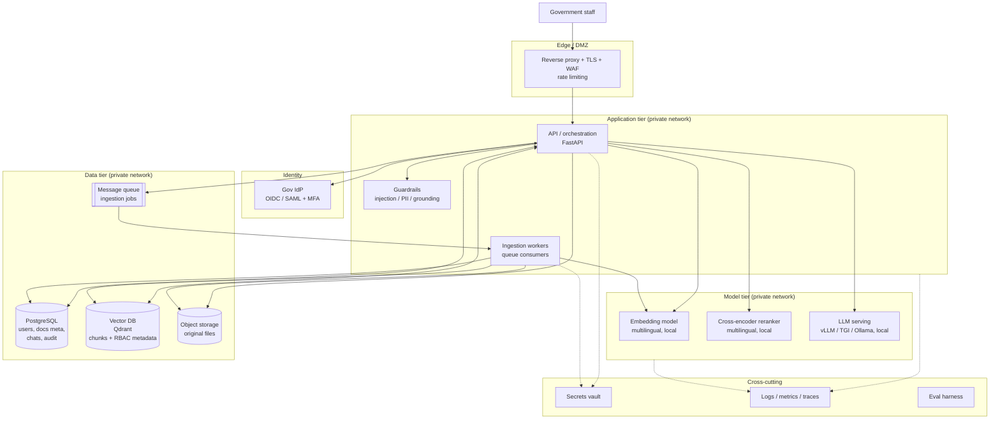

# GovAI — Target Production Architecture

Status: proposal for review. Author: architecture assessment.
Scope: the production architecture for a self-sovereign, LLM-based knowledge
solution for government, building on the existing proof of concept in this
repository.

This document is deliberately decision-flexible on two axes that are not yet
fixed: the **deployment target** (air-gapped, on-prem, or sovereign cloud) and
the **scale** (single department through national, multi-ministry). The
architecture below holds across all of those; where a choice depends on the
axis, the option is called out inline and summarised in the deployment-tiers
section.

---

## 1. Requirement and first principles

The requirement is a knowledge system where government staff can ask natural
language questions and get cited, grounded answers over the government's own
documents, **without that data ever leaving infrastructure the government
controls**, and where **who can see what is provably enforced**.

Five principles follow from "self-sovereign" and drive every decision:

1. **Data sovereignty by default.** No document, query, embedding, or answer
   leaves controlled infrastructure. Any exception (for example a hosted model
   for low-sensitivity data) is an explicit, auditable configuration decision,
   never a silent default.
2. **Provable access control.** Authorization is enforced at the data layer
   (retrieval), not just the UI. A user must not be able to surface, via chat,
   anything they could not open directly.
3. **Grounded, attributable answers.** Every answer cites its sources. The
   system is a retrieval system with a language model on top, not a language
   model that occasionally retrieves.
4. **Auditable and accountable.** Every security-relevant action is logged
   append-only: who, what, over which documents, from where, when.
5. **Operable by a small platform team.** Legible components, standard
   technology, no exotic dependencies. Sovereignty often means running in
   constrained or disconnected environments where deep vendor support is not
   available.

The existing PoC already embodies principles 1 to 4 in its core design. This
document is mostly about hardening, scaling, and closing the production gaps,
not redesigning.

---

## 2. Sovereignty model (deployment-flexible)

The same logical architecture deploys into any of three sovereignty postures.
The only things that change are the network boundary and whether the hosted
LLM provider is permitted at all.

| Posture | Outbound internet | LLM | Embeddings | When to choose |
|---|---|---|---|---|
| **Air-gapped** | None | Self-hosted only (vLLM/Ollama) | Self-hosted | Highest classification; models and images transferred offline once |
| **On-prem, connected** | Restricted egress | Self-hosted default; hosted API allowed per-classification | Self-hosted | Gov data centre, controlled network |
| **Sovereign cloud** | Within-border region | Self-hosted default; national/approved API optional | Self-hosted | Data-residency guarantee inside national cloud |

Design rule: **the application code is identical across all three.** Sovereignty
is a deployment and configuration property (network policy, `LLM_PROVIDER`,
egress rules), not a code fork. The PoC's provider abstraction
(`app/rag/llm/base.py`) is what makes this possible and must be preserved.

---

## 3. Target component architecture

### 3.1 Layer responsibilities

- **Edge / DMZ** — the only externally reachable surface. Terminates TLS,
  applies WAF rules, rate limiting, and request-size limits. Everything behind
  it is on a private network with no direct external exposure.
- **Identity** — authentication delegated to the government's existing identity
  provider over OIDC or SAML, with MFA. The application issues short-lived
  session tokens after IdP login; it does not own passwords in production.
- **Application tier** — stateless API and orchestration (the current FastAPI
  app), plus separate ingestion workers, plus a guardrails stage. Stateless so
  it scales horizontally and restarts cleanly.
- **Model tier** — embeddings, reranker, and the LLM, all self-hosted by
  default. Kept as separate services so they scale (and get GPUs) independently
  of the API.
- **Data tier** — Postgres (system of record), the vector DB (chunk vectors +
  access metadata), object storage for original files, and a durable queue for
  ingestion jobs.
- **Cross-cutting** — secrets vault, observability (logs/metrics/traces), and a
  retrieval/answer evaluation harness.

---

## 4. Layer-by-layer decisions and rationale

### 4.1 Retrieval and RAG pipeline

The heart of the system. Target pipeline for a query:

1. **Authenticate and resolve** the caller's role, department, and clearance.
2. **Embed the query** locally with the multilingual model.
3. **Hybrid retrieval**: dense vector search (Qdrant) combined with lexical
   search (BM25) so exact terms, names, and codes are not lost by pure
   semantic matching. Both are filtered by the RBAC metadata filter so
   unauthorized chunks are never candidates.
4. **Rerank** the merged candidate set with a multilingual cross-encoder
   (for example `bge-reranker-v2-m3`), keep the top N. This is the single
   biggest precision improvement over the PoC's vector-only retrieval and is
   worth prioritising.
5. **Assemble grounded context** as numbered, cited excerpts.
6. **Generate** with the configured LLM at low temperature, instructed to
   answer only from the provided context and to abstain when the answer is not
   present.
7. **Post-check and persist**: verify citations, run output guardrails, save
   the answer with citations, write the audit entry.

Rationale: the PoC does steps 1, 2, 6, 7 well. Adding hybrid search and the
reranker (steps 3 and 4) is the highest-leverage quality change. Abstention
("I could not find this in the available documents") is essential for a
government tool where a confident wrong answer is worse than no answer.

### 4.2 Access control (keep and extend)

Keep the PoC's core design exactly: **one authorization rule, compiled into
both the document-list query and the vector-search filter**, so the two can
never drift. This is the correct pattern and is hard to retrofit, so preserving
it is a real head start.

Extensions for production:
- Move from three fixed roles toward attribute-based access (clearance level,
  department, need-to-know tags, document sensitivity) so it maps onto real
  government classification schemes. The current role/classification matrix is
  a clean special case of this.
- Enforce the same filter on any future retrieval surface (summaries, exports,
  analytics) so there is exactly one access decision point.
- Add row-level and object-level authorization on the original file download
  path, not just chat retrieval.

### 4.3 Models (self-hosted, scale-dependent serving)

- **Embeddings**: keep a local multilingual model. `multilingual-e5-base` is a
  reasonable default; evaluate a larger variant or a domain-tuned model against
  a labelled retrieval set before committing.
- **Reranker**: add a local multilingual cross-encoder (new component).
- **LLM serving**: Ollama is fine for a demo and small single-node deployments.
  For medium and large scale, serve open-weight models with **vLLM or TGI on
  GPUs** for real throughput and concurrency. The provider abstraction means
  this is a config and ops change, not an application rewrite.
- **Model governance**: pin model versions, record which model answered each
  query in the audit log, and re-run the eval suite before any model change.

### 4.4 Data and storage

- **PostgreSQL** as system of record (as now), but with **Alembic migrations**
  instead of `create_all`, plus backups and a tested restore procedure.
- **Object storage** (for example MinIO on-prem, or the sovereign cloud's
  object store) for original files instead of a local disk volume, so storage
  scales and is backed up independently of the app containers.
- **Vector DB**: keep Qdrant. It scales from single-node to clustered; its
  first-class payload filtering is what the RBAC-at-retrieval design depends
  on. Plan for snapshot/backup of the collection alongside Postgres.
- **Durable ingestion queue** (Celery/Arq/RQ + Redis, or a broker already
  approved in the environment) so a backend crash does not lose in-flight
  ingestion, and ingestion throughput scales independently of the API. This
  replaces the PoC's in-process background task.

### 4.5 Security architecture

The production checklist the PoC already names, made concrete:

- **Perimeter**: reverse proxy, TLS everywhere (including between trust
  boundaries internally), WAF, rate limiting, request-size caps.
- **Identity**: OIDC/SAML SSO to the gov IdP, MFA, short-lived tokens, refresh
  handling, forced re-auth for sensitive actions.
- **Secrets**: a vault (HashiCorp Vault or the platform KMS), never plain env
  files, with rotation.
- **Network**: private subnets, default-deny egress (mandatory for air-gap),
  only the edge proxy exposed.
- **Prompt-injection defense**: treat ingested document content as untrusted.
  Documents can contain text aimed at manipulating the model; the system prompt
  and guardrail stage must isolate retrieved content as data, strip or neutralise
  instruction-like payloads, and never let retrieved text escalate the caller's
  privileges.
- **PII handling**: detection and optional redaction at ingestion, retention
  and deletion policy, right-to-erasure support if personal data is in scope.
- **Assurance**: dependency scanning, SBOM, container image scanning, and a
  formal penetration test before go-live.

### 4.6 Observability and evaluation

- **Operational**: structured logs, metrics (latency, tokens/sec, retrieval
  hit rate, queue depth), and distributed tracing across API to model tier.
- **Audit**: keep and extend the append-only audit log; consider shipping it to
  a tamper-evident store for compliance.
- **Quality evaluation**: a standing eval harness with a labelled question set
  measuring retrieval recall, answer faithfulness/grounding, citation accuracy,
  and abstention correctness. Run it in CI and before any model or prompt
  change. This is what keeps a government system trustworthy over time and is
  entirely absent from the PoC (appropriately, for a PoC).

---

## 5. Deployment tiers and scaling path

Because scale is not yet fixed, the architecture is specified as three tiers on
one continuum. Start at the tier that fits, grow along the path.

| Concern | Small (single dept) | Medium (multi-dept) | Large (national) |
|---|---|---|---|
| Users / docs | dozens / thousands | hundreds / tens of thousands | thousands / millions |
| Orchestration | Docker Compose, single host | Compose or small K8s, few nodes | Kubernetes, HA, multi-node |
| LLM serving | Ollama, CPU or one GPU | vLLM/TGI, GPU pool | vLLM/TGI, autoscaled GPU pool |
| Vector DB | Qdrant single node | Qdrant single node, backups | Qdrant cluster, sharded |
| Postgres | single instance + backups | primary + replica | HA cluster, PITR |
| Ingestion | queue, 1-2 workers | queue, N workers | queue, autoscaled workers |
| Object storage | volume or MinIO | MinIO / sovereign store | clustered object store |
| Multi-tenancy | one department | department scoping | per-ministry isolation |

The key property: **moving up a tier does not change the application code.** It
changes replica counts, swaps Ollama for vLLM, promotes Qdrant/Postgres to
clustered, and tightens the network. Designing the app tier as stateless from
the start (as the PoC largely is) is what makes this true.

---

## 6. Mapping to the existing PoC

### Keep as-is (correct, hard to retrofit, real head start)

- Local in-process multilingual embeddings.
- Qdrant with per-chunk department/classification payload metadata.
- **RBAC-at-retrieval**: one rule compiled into both the document list and the
  vector filter (`app/core/rbac.py`, `vectorstore.py::_access_filter`). This is
  the single most valuable thing the PoC gets right.
- Pluggable LLM provider behind one interface (`app/rag/llm/base.py`).
- Low generation temperature and mandatory citations.
- Append-only audit log on login, upload, delete, and query.
- FastAPI + SQLAlchemy + React/Vite stack. Standard, legible, appropriate.
- Multilingual support: embeddings, OCR language packs, three-language UI.

### Add (new components)

- Reverse proxy + TLS + WAF + rate limiting at the edge.
- OIDC/SAML SSO + MFA via the gov IdP.
- Hybrid search (BM25 alongside dense) and a **cross-encoder reranker**.
- Durable ingestion queue + separate worker service.
- Object storage for original files.
- Secrets vault, observability stack, and an evaluation harness.
- Guardrails stage: prompt-injection defense on ingested content, PII handling,
  answer abstention.

### Change (production-hardening of existing choices)

- `create_all` to **Alembic migrations**.
- Local disk volume to **object storage** for files.
- In-process background ingestion to **queue + workers**.
- Ollama to **vLLM/TGI** at medium and large scale.
- Fixed 3-role model toward **attribute-based access** aligned to the real
  classification scheme.
- Backups/DR for Postgres and the Qdrant collection.

Net: **no fundamental redesign.** The PoC's architecture is the right shape.
The production system is this PoC plus a hardening and scaling tier around it.

---

## 7. Suggested phased roadmap

Phasing assumes you validate with a pilot before national rollout. Reorder to
taste once deployment target and scale are fixed.

- **Phase 0 — Decisions (now).** Fix deployment posture, scale target,
  classification scheme, and the gov IdP to integrate with. These unblock
  concrete choices (GPU vs CPU, single-node vs cluster, air-gap egress rules).
- **Phase 1 — Security perimeter and identity.** TLS + reverse proxy + rate
  limiting, SSO/MFA, secrets vault, private networking. Makes the PoC safe to
  put in front of real users on a controlled network.
- **Phase 2 — Retrieval quality.** Hybrid search + reranker + abstention +
  eval harness. Biggest jump in answer trustworthiness.
- **Phase 3 — Durability and scale.** Ingestion queue + workers, object
  storage, Alembic, backups/DR, and (if scale demands) vLLM on GPU and
  clustered data stores.
- **Phase 4 — Assurance and go-live.** Prompt-injection and PII guardrails,
  penetration test, dependency/image scanning, retention policy, DR drill.

---

## 8. Key risks and how the architecture addresses them

- **Answer hallucination in a high-trust setting.** Mitigated by grounded RAG,
  low temperature, mandatory citations, reranking for precision, forced
  abstention, and a standing faithfulness eval. A wrong confident answer is the
  top product risk for a government tool.
- **Authorization leak via chat.** Mitigated by RBAC-at-retrieval as the single
  access decision point, enforced identically on every surface. Already the
  PoC's strongest property.
- **Prompt injection through ingested documents.** Mitigated by treating
  retrieved content as untrusted data, isolating it in the prompt, and a
  guardrail stage. This is specific to RAG over documents an adversary might
  author or upload.
- **Sovereignty regression.** Mitigated by keeping self-hosted models the
  default, making any hosted-provider use an explicit auditable config change,
  and default-deny egress at the network layer.
- **Operational fragility in constrained environments.** Mitigated by standard,
  legible components a small team can run, and by air-gap-compatible design
  (all models and images transferable offline).
